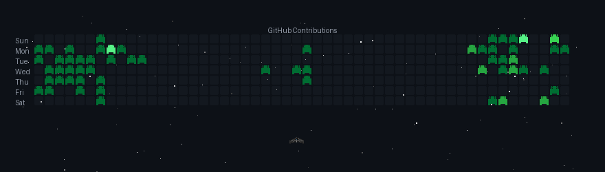

## 🔎 Sobre Mim:
📖&nbsp;&nbsp;|&ensp;***Estudante de Engenharia da Computação*** 
 &nbsp;♟&nbsp;&nbsp;|&ensp;***Back-end developer*** 
 &nbsp;📍&nbsp;&nbsp;&nbsp;|&ensp;***Santo Antônio do Leverger, Brasil*** 
&nbsp;🎈&nbsp;&nbsp;|&ensp;***23 anos***

  
## 🛠️ Principais Conhecimentos

  

## 🛩 Contribuições

